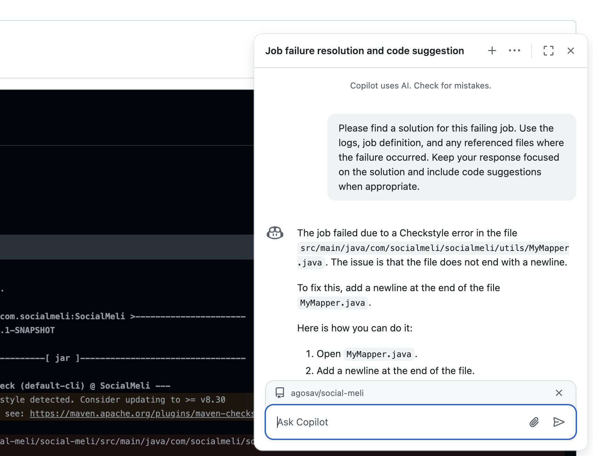

# Cómo revisar errores de Checkstyle

Ir al commit que falló y hacer click en la cruz:  

---

Ir a los “Details” del job que falló  

---

Acá se abre la consola con toda la salida detallados. A veces cuesta encontrar los errores, así que lo que recomiendo es ir a “Explain error” y github copilot me lo explica, me dice en qué archivo y línea es el error, y me dice cómo solucionarlo.  

