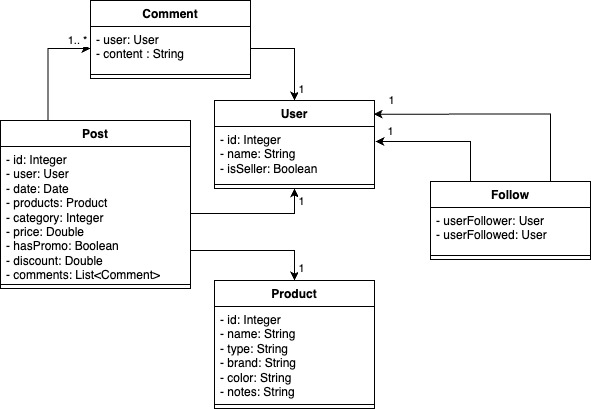

# Social Meli - Grupo 1

## Integrantes

- Avalle, Agostina
- Comba, Carolina
- Navarro, Eliana Denise
- Pairetti, Franca
- Peralta, Katerinne Fernanda
- Sánchez Carrasco, Ciro Tomás

## Features

- **US 0001**: Poder realizar la acción de “Follow” (seguir) a un determinado vendedor.
- **US 0002**: Obtener el resultado de la cantidad de usuarios que siguen a un determinado vendedor.
- **US 0003**: Obtener un listado de todos los usuarios que siguen a un determinado vendedor (¿Quién me sigue?).
- **US 0004**: Obtener un listado de todos los vendedores a los cuales sigue un determinado usuario (¿A quién sigo?).
- **US 0005**: Dar de alta una nueva publicación.
- **US 0006**: Obtener un listado de las publicaciones realizadas en las últimas dos semanas, por los vendedores que un usuario sigue (para esto tener en cuenta ordenamiento por fecha, publicaciones más recientes primero).
- **US 0007**: Poder realizar la acción de “Unfollow” (dejar de seguir) a un determinado vendedor.
- **US 0010**: Llevar a cabo la publicación de un nuevo producto en promoción.
- **US 0011**: Obtener la cantidad de productos en promoción de un determinado vendedor.

## Diagrama de clases

## Documentación

- [Requerimientos técnicos](src/main/resources/static/Esp.%20de%20Req.%20técnicos%20funcionales%20-%20Sprint%20Nº%201%20-%20Spring.pdf)

- [Colección de postman](src/main/resources/static/SocialMeli.postman_collection.json)

- [Trello](https://trello.com/invite/b/678fbbfb30a5a696fb590ac0/ATTIc2cf4176f47e241c9e4e462efe2a66419F89596B/socialmeli)

- [Excel de tests](https://docs.google.com/spreadsheets/d/1AfsBQoXWvVxLtIrFJ-413pfLB_-LI51hj4K99pnVRco/edit?gid=768916971#gid=768916971)
